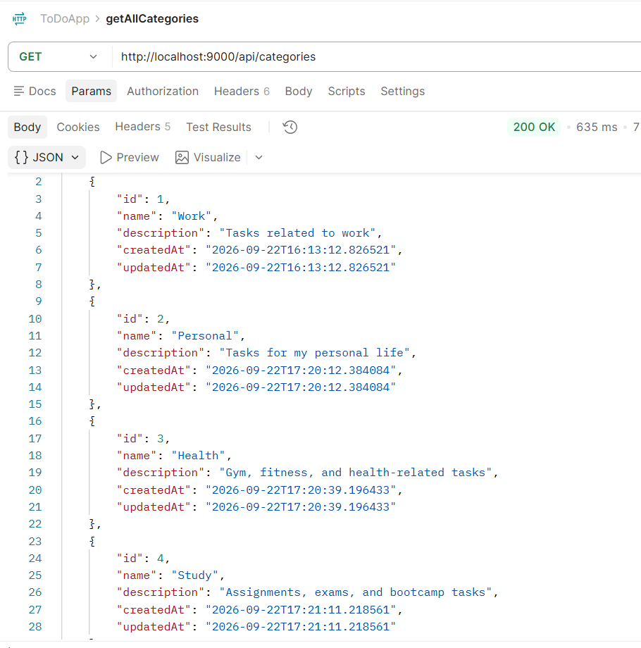
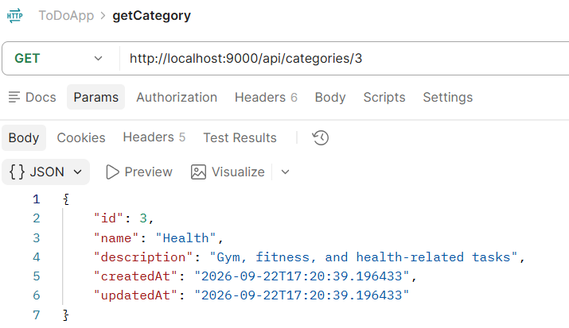
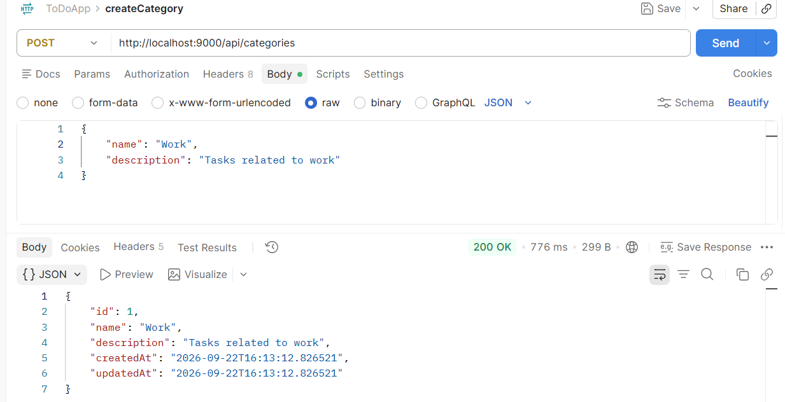
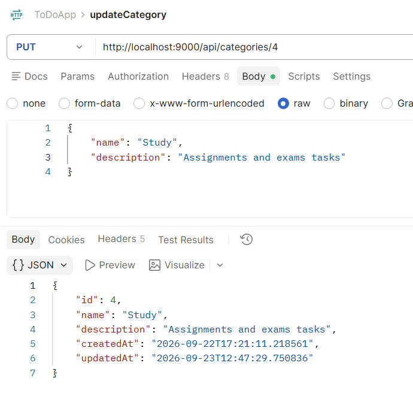
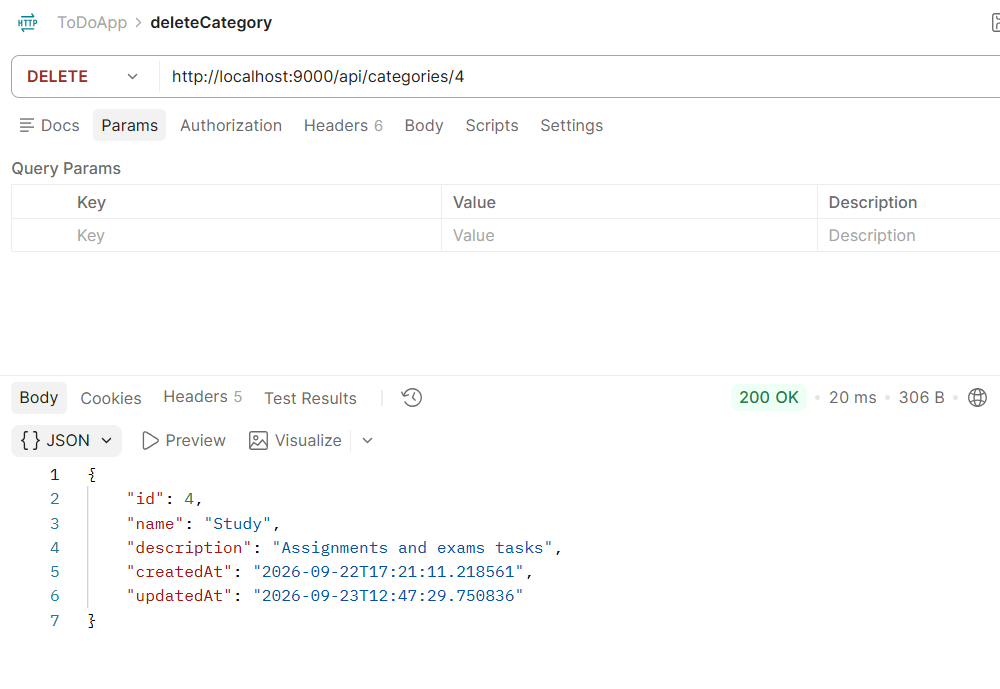
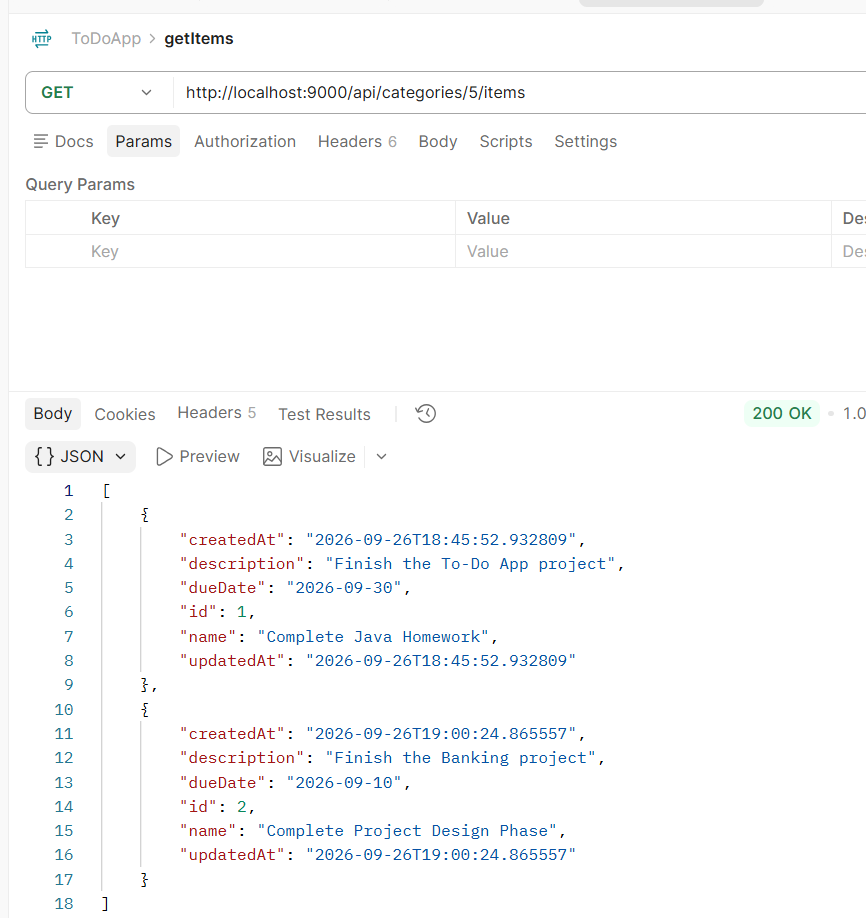
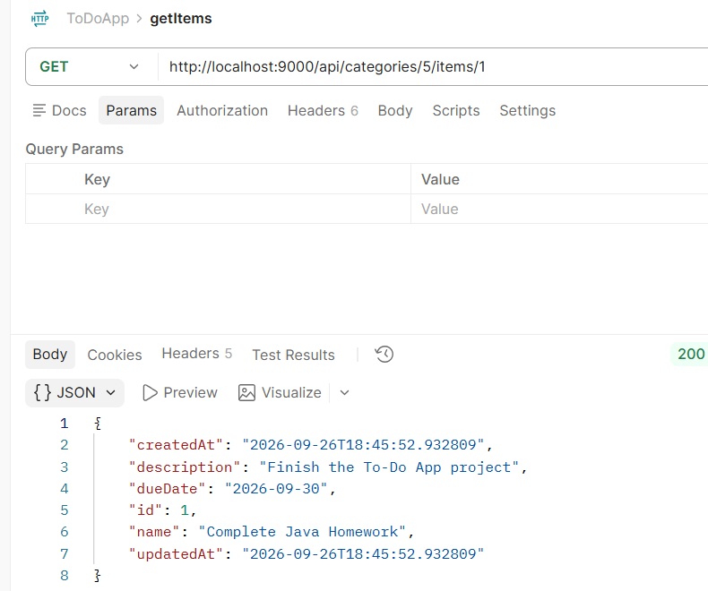
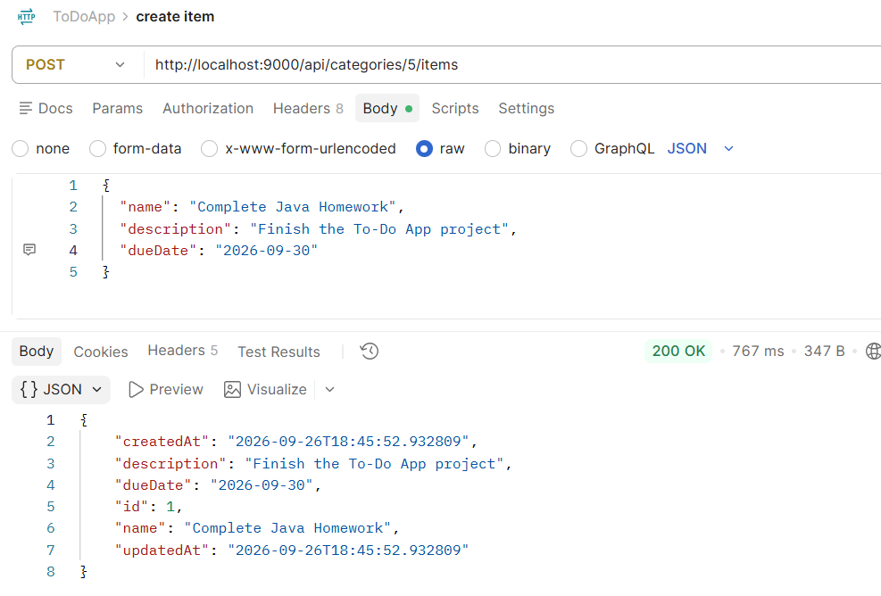
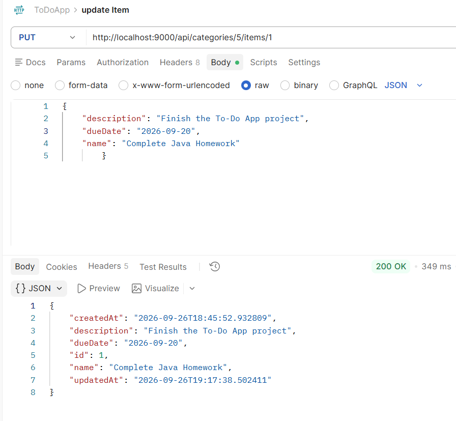

# ToDo App

## About

This is my ToDo App project for the Spring Boot lab. We are building it step by step, and currently I’m working on Step 3(a), which focuses on the Category API.

## GitHub Repo

https://github.com/Batool-Isa/ToDoApp

## Design Decisions

I followed the MVC structure and separated my project into Controller, Service, Model, and Repository layers. The controller handles API requests, the service contains the business logic, the model represents the data, and the repository handles database access.

I chose this structure to separate responsibilities and keep the code organized and easier to maintain.

## What Went Right

I set up the Spring Boot project, connected it to PostgreSQL, and started implementing the Category CRUD API. So far, I have implemented getting all categories, getting a category by ID, and creating a category.

## Challenges

Understanding how the different layers work together and connecting Spring Data JPA with PostgreSQL.

## What I Enjoyed

I enjoyed structuring the project and linking the different layers together, especially seeing how the API connects to the database.

## Screenshots

### Get All Categories

### Get Category by ID

### Create a Category

### Update a Category

### Delete a Category

### Get All Items

### Get Item by ID

### Create an Item

### Update an Item

### Delete an Item
